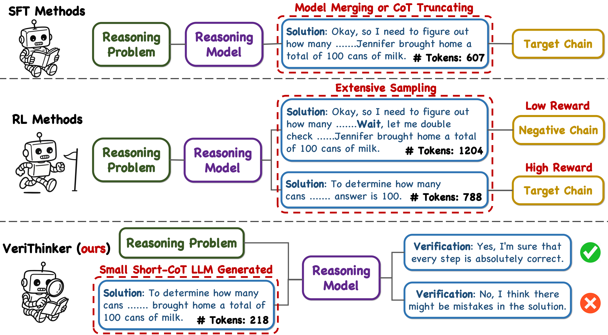
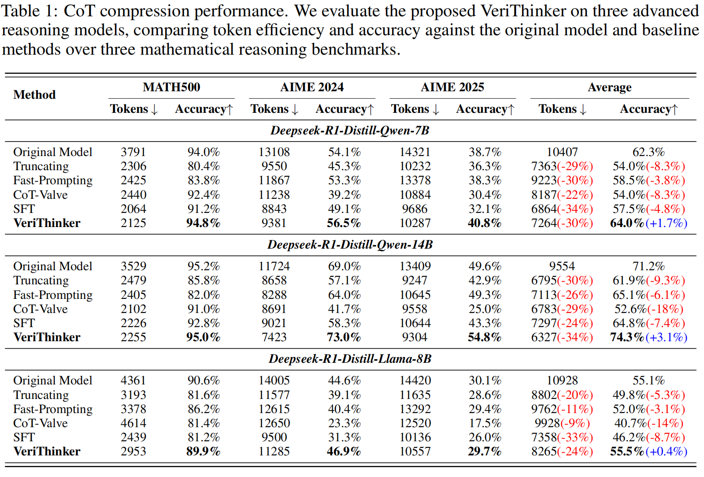
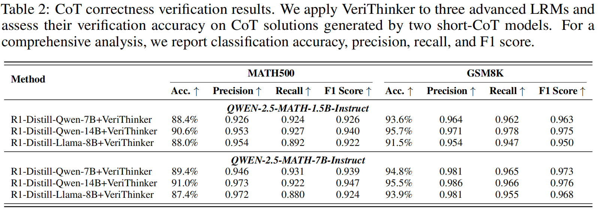
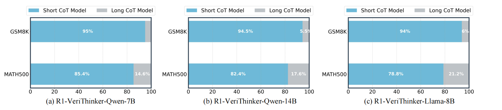
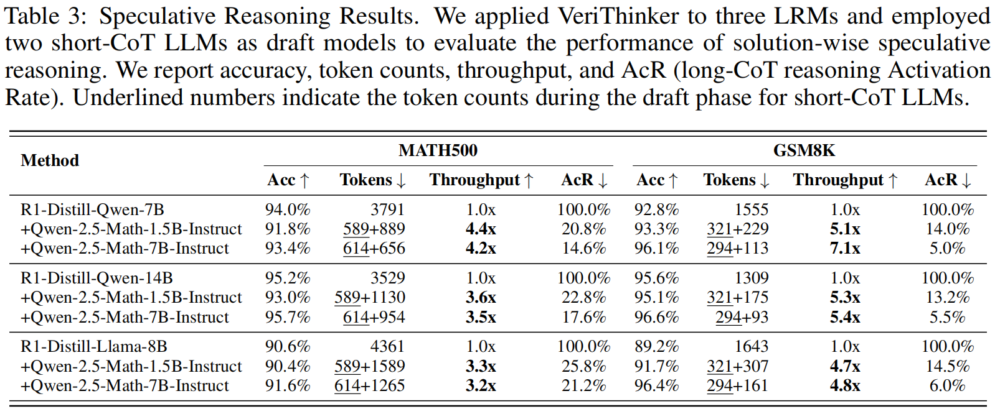

<div align="center">
<h1>🔍 VeriThinker: Learning to Verify Makes Reasoning Model Efficient</h1>

  <div align="center">
  <a href="https://opensource.org/license/mit-0">
    
  </a>
  <a href="https://github.com/czg1225/VeriThinker">
    
  </a>
  <a href="https://huggingface.co/Zigeng/R1-VeriThinker-7B">
    
  </a>
  <a href="https://huggingface.co/datasets/Zigeng/CoT-Veirification-340k">
    
  </a>
</div>
</div>

> **VeriThinker: Learning to Verify Makes Reasoning Model Efficient**   
> [Zigeng Chen](https://github.com/czg1225), [Xinyin Ma](https://horseee.github.io/), [Gongfan Fang](https://fangggf.github.io/), [Ruonan Yu](https://scholar.google.com/citations?user=UHP95egAAAAJ&hl=en), [Xinchao Wang](https://sites.google.com/site/sitexinchaowang/)   
> [xML Lab](https://sites.google.com/view/xml-nus), National University of Singapore  


## 💡 Introduction
We introduce VeriThinker, a novel approach for CoT compression. Unlike conventional methods that fine-tune LRMs directly on the original reasoning task using synthetic concise CoT data, we innovatively fine-tune the model solely through an auxiliary verification task. By training LRMs to accurately verify the correctness of CoT solutions, the LRMs inherently become more discerning about the necessity of subsequent self-reflection steps, thereby effectively suppressing overthinking. Extensive experiments validate that VeriThinker substantially reduces reasoning chain lengths while maintaining or even slightly improving accuracy. When applied to DeepSeek-R1-Distill-Qwen-7B, our approach reduces reasoning tokens on MATH500 from 3790 to 2125 while improving accuracy by 0.8% (94.0% to 94.8%), and on AIME25, tokens decrease from 14321 to 10287 with a 2.1% accuracy gain (38.7% to 40.8%). Additionally, our experiments demonstrate that VeriThinker can also be zero-shot generalized to speculative reasoning to boost throughput.

<!--  -->
<div align="center">
  </img>
  <br>
  <em>
      The key distinction between VeriThinker and traditional SFT or RL-based long-to-short methods. We uniquely train LRMs on an auxiliary CoT verification task, achieving effective CoT compression without relying on synthetic target reasoning chains.
  </em>
</div>
<br>


## 💻 Model and Datasets
<table>
<table>
  <thead>
  </thead>
  <tbody>
    <tr>
      <td>📄 <strong>Paper</strong></td>
      <td><a href="https://github.com/czg1225/VeriThinker">ArXiv-Link</a></td>
    </tr>
    <tr>
      <td>🤖 <strong>Model</strong></td>
      <td><a href="https://huggingface.co/Zigeng/R1-VeriThinker-7B">R1-VeriThinker-7B</a></td>
    </tr>
    <tr>
      <td>📊 <strong>Data</strong></td>
      <td><a href="https://huggingface.co/datasets/Zigeng/CoT-Veirification-340k">
CoT-Veirification-340k</a></td>
    </tr>
  </tbody>
</table>

## 🔥Updates
* 🔥 **May 27, 2025**: Our arxiv paper will available
* 🔥 **May 27, 2025**: Code, model and dataset are released

## 🔧  Installation:

```bash
conda create -n verithinker python==3.10
conda activate verithinker
pip3 install -r requirements.txt
```

## 🚀 Quick Start:
### Reasoning Task:
```python
from transformers import AutoModelForCausalLM, AutoTokenizer

model_name = "Zigeng/R1-VeriThinker-7B"

# load the tokenizer and the model
tokenizer = AutoTokenizer.from_pretrained(model_name)
model = AutoModelForCausalLM.from_pretrained(
    model_name,
    torch_dtype="auto",
    device_map="auto"
)

# prepare the model input
prompt = "Given a=4, b=7, please help me calculate a*2+b*3+(a+b)^2."
tail = r" Please reason step by step, and put your final answer within \boxed{}."
messages = [
    {"role": "user", "content": prompt + tail}
]
text = tokenizer.apply_chat_template(
    messages,
    tokenize=False,
    add_generation_prompt=True,
)

model_inputs = tokenizer([text], return_tensors="pt").to(model.device)

# conduct text completion
generated_ids = model.generate(
    **model_inputs,
    max_new_tokens=16384,
    temperature=0.6,
    top_p=0.95,
)

generated_ids = [
    output_ids[len(input_ids):] for input_ids, output_ids in zip(model_inputs.input_ids, generated_ids)
]

response = tokenizer.batch_decode(generated_ids, skip_special_tokens=True)[0]

print(response)
```
### Correctness Veirification Task:
```python
from transformers import AutoModelForCausalLM, AutoTokenizer

model_name = "Zigeng/R1-VeriThinker-7B"

# load the tokenizer and the model
tokenizer = AutoTokenizer.from_pretrained(model_name)
model = AutoModelForCausalLM.from_pretrained(
    model_name,
    torch_dtype="auto",
    device_map="auto"
)

# prepare the model input
prompt_part_1 = "## Instruction:\nYou will be provided with a question along with a proposed solution. Please carefully verify each step of the solution, tell me if every step is absolutely correct.\n\n" 


prompt_part_2 = """## Question:
{} Please reason step by step, and put your final answer within \\boxed{}.

## Proposed Solution:
{}
"""

question = "Given a=4, b=7, please help me calculate a*2+b*3+(a+b)^2."
cot_solution = """First, let's parse and calculate the given expression a*2+b*3+(a + b)^2 step by step, where a=4 and b=7.

Calculate a * 2: 4 * 2 = 8

Calculate b * 3: 7 * 3 = 21

Calculate (a + b)^2: (4 + 7)^2 = 11^2 = 121

Add the above results: 8 + 21 + 121 = 150

The final result is \\boxed{150}.
"""
prompt = prompt_part_1+prompt_part_2.format(question,"{}", cot_solution)

messages = [
    {"role": "user", "content": prompt}
]
text = tokenizer.apply_chat_template(
    messages,
    tokenize=False,
    add_generation_prompt=True,
)

model_inputs = tokenizer([text], return_tensors="pt").to(model.device)

# conduct text completion
generated_ids = model.generate(
    **model_inputs,
    max_new_tokens=64,
    do_sample=False
)

generated_ids = [
    output_ids[len(input_ids):] for input_ids, output_ids in zip(model_inputs.input_ids, generated_ids)
]

response = tokenizer.batch_decode(generated_ids, skip_special_tokens=True)[0]

print(response)
```

## 🔥 Training
### 1. Training with LoRA:
We provide training scripts for our proposed supervised verification fine-tuning approach. The implementation utilizes LoRA during the training process, with the configuration details specified in [config_lora_r1_7b.yaml](https://github.com/czg1225/VeriThinker/blob/main/config/config_lora_r1_7b.yaml).
```bash
deepspeed --include localhost:0,1,2,3,4,5,6,7 train_svft.py
```

### 2. LoRA Merge:
After training, merge the LoRA weights to get the reasoning model.
```bash
python merge_lora.py
```

## ⚡ Evaluation:
We provide evaluation scripts for three mathematical datasets: MATH500, AIME 2024, and AIME 2025. Our implementation leverages the [vLLM](https://docs.vllm.ai/en/latest/) framework to ensure efficient inference during evaluation.

### 1. Evaluation on MATH500 Dataset
```bash
CUDA_VISIBLE_DEVICES=0,1,2,3 python eval_math500.py
```
### 2. Evaluation on AIME 2024 Dataset
```bash
CUDA_VISIBLE_DEVICES=0,1,2,3 python eval_aime24.py
```
### 3. Evaluation on AIME 2025 Dataset
```bash
CUDA_VISIBLE_DEVICES=0,1,2,3 python eval_aime25.py
```

## 📖 Experimental Results
### CoT Compression Results:


### CoT Correctness Verification Results:


### Speculative Reasoning Results:
Speculative reasoning results on three reasoning models. When using Qwen-2.5-Math-Instruct-7B as the draft model, most problems in MATH500 and GSM8K can be solved with short CoT model, while only a few (around 10%) require activation of the long CoT model for more complex solutions.



## Citation
If our research assists your work, please give us a star ⭐ or cite us using:
```

```